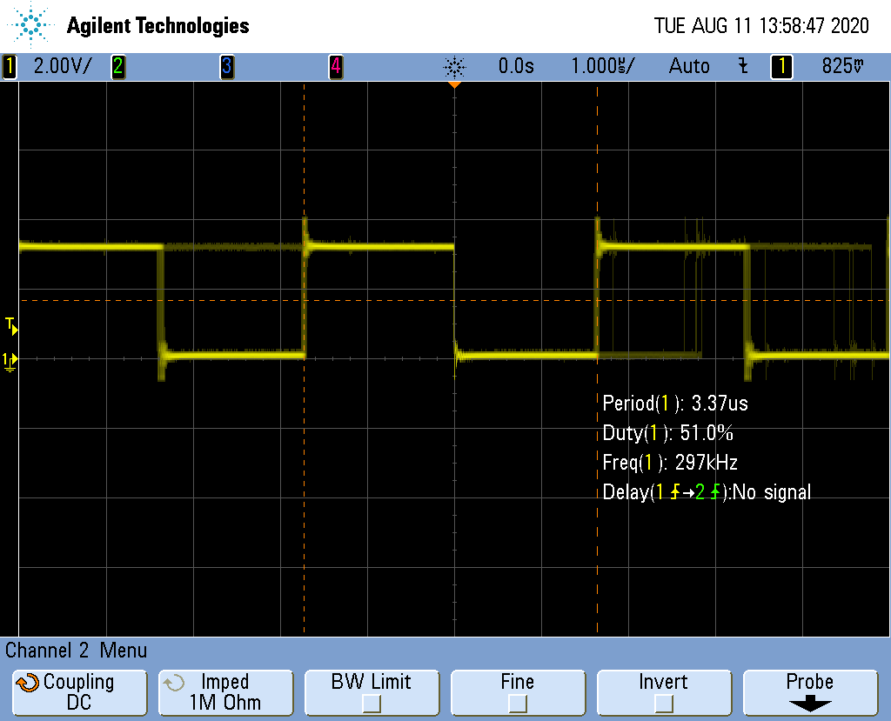

libgpiod is a new C library and tools for interacting with the linux GPIO
character device

Detailed information is 
[here](https://git.kernel.org/pub/scm/libs/libgpiod/libgpiod.git/tree/README)
and [Adafruit](https://blog.adafruit.com/2018/11/26/sysfs-is-dead-long-live-libgpiod-libgpiod-for-linux-circuitpython/)
also has information.

One of the advantages of gpiod is that it can toggle multiple bit on the same
gpio chip at the same time.  The toggl2 examples 

The directory contains examples of using gpiod with C and python to read/write
a gpio pin.

File                | Description
----                | -----------
[toggle1](toggle1.c)    | Toggles one pin as fast as possible.  (300KHz in C, 6.9KHz in python)
[toggle2](toggle2.c)    | Toggles two pins as fast as possible.  (280KHz in C,  KHz in python)

