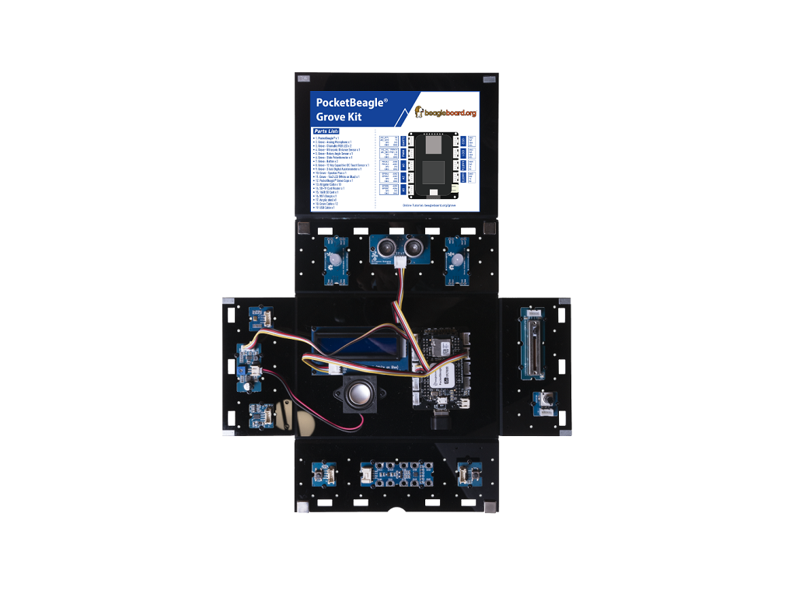

## ACD LCD

### Description:

In this example the LCD will display the first six ADC values.

### Hardware Requirement:

- [Grove - 16x2 LCD](http://wiki.seeedstudio.com/Grove-16x2_LCD_Series/)
- No more since ADCs are bult-in


### Hardware Connection
 
- Plug the Grove - 16x2 LCD into **I2C1** port
- Plug the WiFi dongle into the **USB** Port
- Power PocketBeagle via the **micro USB** port



### Software

- Step 1. Enter Cloud9 IDE by typing IP of PocketBeagle
- Step 2. Select PocketBeagle -> Grove
- Step 3. Run the **./ADCLCD.py** by using Runner:Python.

### Success
        The values should appear on the LCD screen and in the terminal.
```bash
bone$ ./ADCLCD.py
0002  0001  0003  0002  0479  0000
```
