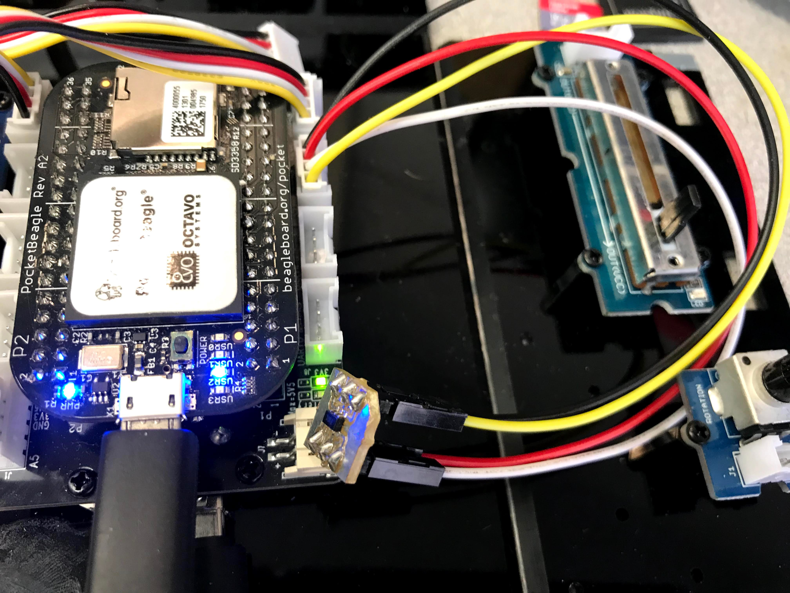

# Adding a tmp101 temperature sensor

The [tmp101](https://www.ti.com/product/TMP101) is an i2c-based temperature sensor
that can be easily added to the Grove Kit using a JST-4 to female lead connected to
either of the Grove i2c ports.  Here I'm using i2c1.



Once wired, run `i2cdetect` to see the sensor.
The `1` at the end of the command says to look at bus `1`.

```
bone$ i2cdetect -y -r 1
     0  1  2  3  4  5  6  7  8  9  a  b  c  d  e  f
00:          -- -- -- -- -- -- -- -- -- -- -- -- --
10: -- -- -- -- -- -- -- -- UU -- -- -- -- -- -- --
20: -- -- -- -- -- -- -- -- -- -- -- -- -- -- -- --
30: -- -- -- -- -- -- -- -- -- -- -- -- -- -- -- --
40: -- -- -- -- -- -- -- -- -- 49 -- -- -- -- -- --
50: -- -- -- -- -- -- -- -- -- -- -- -- -- -- -- --
60: -- -- -- -- -- -- -- -- -- -- -- -- -- -- -- --
 ```
 
 Here we see the tmp101 appearing at address `0x49`. You can read the
 temp from the command line with:
 ```
 bone$ i2cget -y 1 0x49
0x1c
```
0x1c hex is 28 decimal, so it's 28 degrees C or 82 F, a bit warm.

A better way to read the temperature is using the kernel driver.

```
bone$ cd /sys/class/i2c-adapter/i2c-1/
bone$ ls -ls
total 0
0 drwxrwxr-x 3 root gpio    0 Aug  5 10:35 1-0018
0 drwxrwxr-x 3 root gpio    0 Dec 31  1999 1-003e
0 --w--w---- 1 root gpio 4096 Aug  5 13:24 delete_device
0 lrwxrwxrwx 1 root gpio    0 Aug  5 10:35 device -> ../../4802a000.i2c
0 drwxrwxr-x 3 root gpio    0 Dec 31  1999 i2c-dev
0 -r--r--r-- 1 root gpio 4096 Dec 31  1999 name
0 --w--w---- 1 root gpio 4096 Aug  5 13:22 new_device
0 lrwxrwxrwx 1 root gpio    0 Aug  5 10:35 of_node -> ../../../../../../../../firmware/devicetree/base/ocp/interconnect@48000000/segment@0/target-module@2a000/i2c@0
0 drwxrwxr-x 2 root gpio    0 Dec 31  1999 power
0 lrwxrwxrwx 1 root gpio    0 Aug  5 10:35 subsystem -> ../../../../../../../../bus/i2c
0 -rw-rw-r-- 1 root gpio 4096 Dec 31  1999 uevent
```
With the tmp101 at address `0x49`
```
bone$ echo tmp101 0x49 > new_device
```
Look again you'll see:
```
bone$ ls
1-0018  1-003e  1-0049  delete_device  device  i2c-dev  name  new_device  of_node  power  subsystem  uevent
```
`1-0049` has appeared.  Explore it.
```
bone$ cd 1-0049/hwmon/hwmon0/
bone$ ls
device  name  power  subsystem  temp1_input  temp1_max  temp1_max_hyst  uevent  update_interval
bone$ cat temp1_input
23500
```
It's now 23.5 degrees C.  So now, rather than having to run the i2c commands
you just read the file `temp1_input`.
