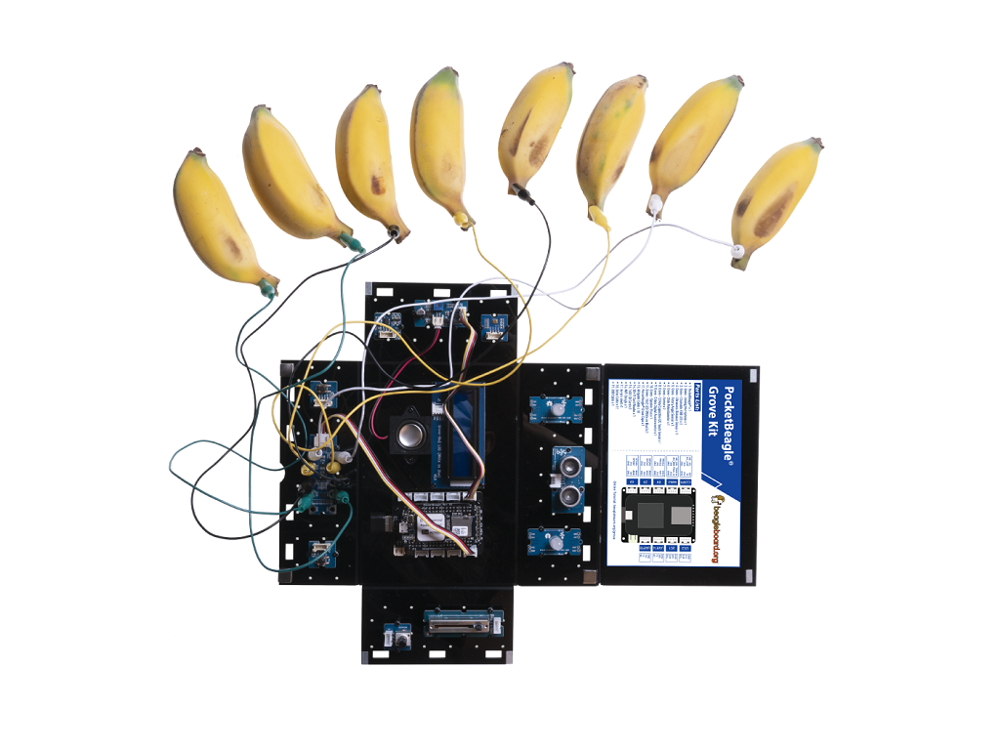

## Capacitive Touch

### Description:

In this lesson, students will learn how to use the capacitive touch sensor.

### Hardware Requirement:

- [Grove - 12 Key Capacitive I2C Touch Sensor](http://wiki.seeedstudio.com/Grove-12_Key_Capacitive_I2C_Touch_Sensor_V2-MPR121/)

### Hardware Connection

- Plug the Grove - 12 Key Capacitive I2C Touch Sensor into **I2C2** port
- Plug the WiFi dongle into the **USB** Port
- Power the PocketBeagle via the **micro USB** port




### Software

- Step 1. Enter Cloud9 by typing IP of PocketBeagle
- Step 2. Select PocketBeagle -> Grove
- Step 3. Run the ./Captouch.py by using Runner:Python.

### Success
        Try to touch the Capacitive key, image it as a keyboard, and play your music.
```bash
bone$ ./Captouch.py 
[1004, [0, 0, 1, 0, 0, 0, 0, 0, 0, 0, 0, 0]]        
[1004, [0, 0, 1, 0, 0, 0, 0, 0, 0, 0, 0, 0]] 
```
