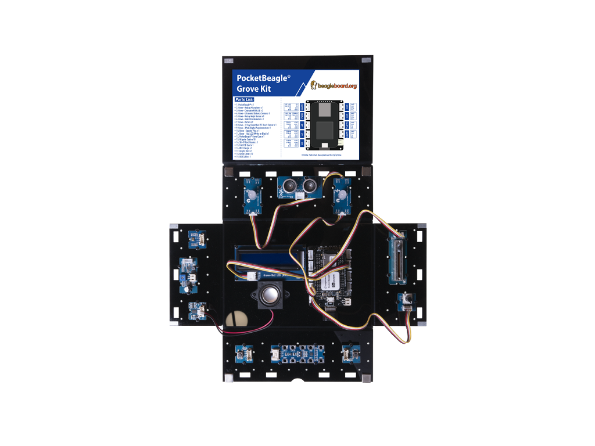

## Lesson - 1. Control the Light

### Description:

In this lesson, students will light up the RGB LED and LCD, and learn how to use Slide Potentiometer and Rotary Angle Sensor to change the light of RGB LED.

### Hardware Requirement:

- [Grove - Slide Potentiometer](https://www.seeedstudio.com/Grove-Slide-Potentiometer.html)
- [Grove - Rotary Angle Sensor](http://wiki.seeedstudio.com/Grove-Rotary_Angle_Sensor/)
- [Grove - Chainable RGB LED](http://wiki.seeedstudio.com/Grove-Chainable_RGB_LED/)
- [Grove - 16x2 LCD](http://wiki.seeedstudio.com/Grove-16x2_LCD_Series/)

### Hardware Connection
 
- Plug the Grove - Slide Potentiometer into **A0** port
- Plug the Grove - Rotary Angle Sensor into **A5** port
- Plug the Grove - Chainable RGB LED into **A2** port
- Plug the Grove - 16x2 LCD into **I2C1** port
- Plug the WiFi dongle into the **USB** Port
- Power PocketBeagle via the **micro USB** port

### Software

- Step 1. Enter Cloud9 IDE by typing IP of PocketBeagle
- Step 2. Select PocketBeagle -> Grove
- Step 3. Run the Control_the_Light.py by using Runner:Python.

### Success
        Now please turn the rotary angle sensor slowly and slide Slide Potentiometer, and see how the RGB LED changes it's light and color.  Note, the LCD display shows the current values.
