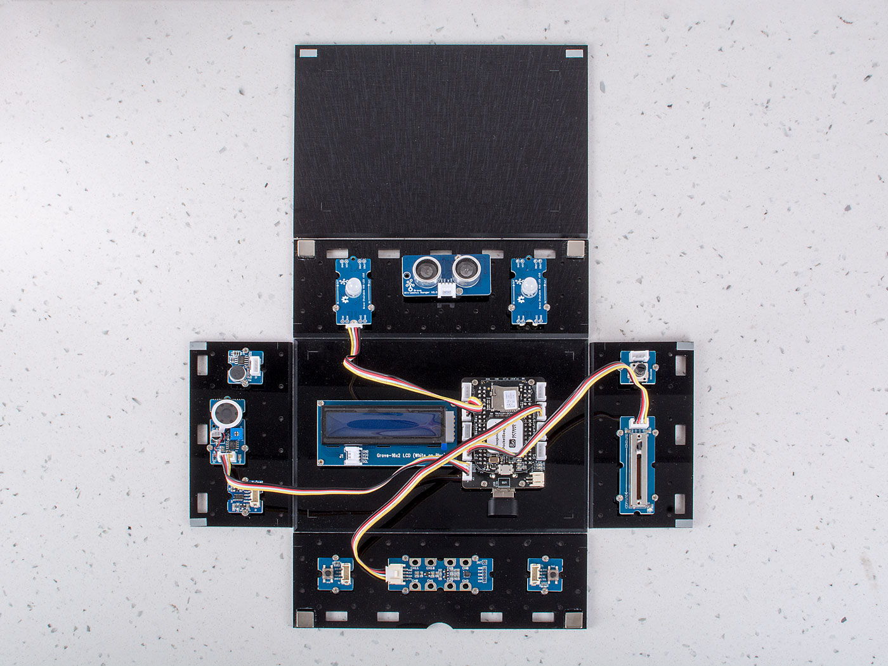

# Setup of pocketbeagle kit

firstly, you should visit [Getting_Started](https://github.com/beagleboard/pocketbeagle/wiki/System-Reference-Manual#331_Getting_Started) to get a start. 
Then maybe you can read below information to get how to connect wifi and get IP.
`connmanctl` is a tool that connects Pockbeagle to the internet with WiFi Dongle, please refer below command

```bash
robot@ev3dev:~$ sudo connmanctl
Error getting VPN connections: The name net.connman.vpn was not provided by any
connmanctl> enable wifi
Enabled wifi
connmanctl> scan wifi
Scan completed for wifi
connmanctl> services
*AO Wired                ethernet_b827ebbde13c_cable
                         wifi_e8de27077de3_hidden_managed_none
    AH04044914           wifi_e8de27077de3_41483034303434393134_managed_psk
    Frissie              wifi_e8de27077de3_46726973736965_managed_psk
    ruijgt gast          wifi_e8de27077de3_7275696a67742067617374_managed_psk
    schuur               wifi_e8de27077de3_736368757572_managed_psk
connmanctl> agent on
Agent registered
connmanctl> connect wifi_e8de27077de3_41      # You can use the TAB key at this point to autocomplete the name
connmanctl> connect wifi_e8de27077de3_41483034303434393134_managed_psk
Agent RequestInput wifi_e8de27077de3_41483034303434393134_managed_psk
  Passphrase = [ Type=psk, Requirement=mandatory ]
Passphrase? *************
Connected wifi_e8de27077de3_41483034303434393134_managed_psk
connmanctl> quit
```
we can use `ifconfig` to get IP of pocketbeagle

# Lesson - 1. Control the Light

## Description:

In this lesson, students will light up the RGB LED and LCD, and learn how to use Slide Potentiometer and Rotary Angle Sensor to change the light of RGB LED.

## Hardware Requirement:

- [Grove - Slide Potentiometer](https://www.seeedstudio.com/Grove-Slide-Potentiometer.html)
- [Grove - Rotary Angle Sensor](http://wiki.seeedstudio.com/Grove-Rotary_Angle_Sensor/)
- [Grove - Chainable RGB LED](http://wiki.seeedstudio.com/Grove-Chainable_RGB_LED/)
- [Grove - 16x2 LCD](http://wiki.seeedstudio.com/Grove-16x2_LCD_Series/)

## Hardware Connection
 
- Plug the Grove - Slide Potentiometer into **A0** port
- Plug the Grove - Rotary Angle Sensor into **A5** port
- Plug the Grove - Chainable RGB LED into **A2** port
- Plug the Grove - 16x2 LCD into **I2C1** port
- Power PocketBeagle via the **micro USB** port


## Software

- Step 1. Enter Cloud9 IDE by typing IP of PocketBeagle
- Step 2. Select PocketBeagle -> Grove
- Step 3. Run the Control_the_Light.py by using Runner:Python.

## Success
        Now please turn the rotary angle sensor slowly and slide Slide Potentiometer, and see how the RGB LED changes it's light and color.


# Lesson - 2. Musical Note

## Description:

In this lesson, students can move their hand in front of the ultrasonic distance sensor, the LCD will show the distance of the hand, and speaker will play different musical note based on different distance.

## Hardware Requirement:

- [Grove - Ultrasonic Distance Sensor](http://wiki.seeedstudio.com/Grove-Ultrasonic_Ranger/)
- [Grove - 16x2 LCD](http://wiki.seeedstudio.com/Grove-16x2_LCD_Series/)
- [Grove - Speaker Plus](http://wiki.seeedstudio.com/Grove-Speaker/)


## Hardware Connection
 
- Plug the Grove - Ultrasonic Distance Sensor into **A0** port
- Plug the Grove - 16x2 LCD into **I2C1** port
- Plug the Grove - Speaker Plus into **UART2** port
- Power PocketBeagle via the **micro USB** port


## Software

- Step 1. Enter Cloud9 IDE by typing IP of PocketBeagle
- Step 2. Select PocketBeagle -> Grove
- Step 3. Run the ToneGenerator.py by using Runner:Python.

**NOTE** : we should run ToneGenerator.py when we restart after.

- Step 4. Run the Musical_Note.py by using Runner:Python.

## Success
        Now please please slowly change the distance between your hand and the ultrasonic distance sensor, you can find the distance value in the LCD change and the music switched by the distance.


# Lesson - 3. Switch the Music

## Description:

In this lesson, students will learn how to use the 2 buttons to select the next song or the last song. the buttons not only can select the next song or the last song by press instantly but also can play music by Press longly.

The LCD will show the name of the song.

## Hardware Requirement:

- [Grove – Button x 2](http://wiki.seeedstudio.com/Grove-Button/)
- [Grove – Speaker Plus](http://wiki.seeedstudio.com/Grove-Speaker/)
- [Grove – 16x2 LCD](http://wiki.seeedstudio.com/Grove-16x2_LCD_Series/)

## Hardware Connection
 
- Plug the Grove – Button into **A5** and **UART4** port
- Plug the Grove – 16x2 LCD into **I2C1** port
- Plug the Grove – Speaker Plus into **UART2** port
- Power PocketBeagle via the **micro USB** port


## Software

- Step 1. Enter Cloud9 IDE by typing IP of PocketBeagle
- Step 2. Select PocketBeagle -> Grove
- Step 3. Run the Switch_the_Music.py by using Runner:Python.

## success
        Now please try to press the two buttons, check the LCD, and listen to the music.


# Lesson - 4. Download Music via the WIFI dongle

## Description:

In this lesson, students will learn how to use the 2 buttons to select the next song or the last song. the buttons not only can select the next song or the last song by press instantly but also can play music by Press longly.

The LCD will show the name of the song.

## Hardware Requirement:

- [Grove - Button x 2](http://wiki.seeedstudio.com/Grove-Button/)
- [Grove - Speaker Plus](http://wiki.seeedstudio.com/Grove-Speaker/)
- [Grove - 16x2 LCD](http://wiki.seeedstudio.com/Grove-16x2_LCD_Series/)

## Hardware Connection
 
- Plug the Grove - Button into **A5** and **UART4** port
- Plug the Grove - 16x2 LCD into **I2C1** port
- Plug the Grove - Speaker Plus into **UART2** port
- Plug the WiFi dongle into the **USB** Port
- Power PocketBeagle via the **micro USB** port


## Software

- Step 1. Enter Cloud9 by typing IP of PocketBeagle
- Step 2. Select PocketBeagle -> Grove
- Step 3. Select File -> Upload Local Files.
- Step 4. Drag `xxx.wav` that you want to play to Cloud9.
- Step 5. Run the Switch_the_Music.py by using Runner:Python.

## success

        Default music is boring and bad taste? Now, with the help of WiFi, you can download the music meet your own flavor.


# Lesson - 5. Keyboard Player

## Description:

In this lesson, students will learn how to use the capacitive touch sensor to play different musical note.

## Hardware Requirement:

- [Grove - 12 Key Capacitive I2C Touch Sensor V2](http://wiki.seeedstudio.com/Grove-12_Key_Capacitive_I2C_Touch_Sensor_V2-MPR121/)
- [Grove – Speaker](http://wiki.seeedstudio.com/Grove-Speaker/)

## Hardware Connection

- Plug the Grove – Speaker into **UART2** port
- Plug the Grove - 12 Key Capacitive I2C Touch Sensor V2 into **I2C2** port
- Power the PocketBeagle via the **micro USB** port


## Software

- Step 1. Enter Cloud9 by typing IP of PocketBeagle
- Step 2. Select PocketBeagle -> Grove
- Step 3. Run the KeyBoard_Player.py by using Runner:Python.

## success
        Try to touch the Capacitive key, image it as a keyboard, and play your music.


# Lesson - 6. Start the Party

## Description:

In this lesson, students will learn how to use the capacitive touch sensor to play the song. And the RGB LED will have different color based on different music note.

### Hardware Requirement:

- [Grove - 12 Key Capacitive I2C Touch Sensor V2](http://wiki.seeedstudio.com/Grove-12_Key_Capacitive_I2C_Touch_Sensor_V2-MPR121/)
- [Grove - Speaker Plus](http://wiki.seeedstudio.com/Grove-Speaker/)
- [Grove - Chainable RGB LED X 2](http://wiki.seeedstudio.com/Grove-Chainable_RGB_LED/)


## Hardware Connection

- Plug the Grove - Speaker Plus into **UART2** port
- Plug the Grove - 12 Key Capacitive I2C Touch Sensor V2 into **I2C2** port
- Plug the Grove - Chainable RGB LED X 2 into **A2** port
- Power PocketBeagle via the **micro USB** port




## Software

- Step 1. Enter Cloud9 by typing IP of PocketBeagle
- Step 2. Select PocketBeagle -> Grove
- Step 3. Run the Start_the_Party.py by using Runner:Python.

## success
        Just control the music as lesson 5, and you can see the color of RGB LED change.


# Lesson - 7. Music Box

## Description:

In this lesson, students will learn how to use the Grove - 3-Axis Accelerometer to control RGB LED and Speaker Plus. At last, he can make a smart box, by putting different side of the box on the table, the box will have different color and play different music.

## Hardware Requirement:

- [Grove - 3 Axis Digital Accelerometer](http://wiki.seeedstudio.com/Grove-3-Axis_Digital_Accelerometer-16g/)
- [Grove - Speaker Plus](http://wiki.seeedstudio.com/Grove-Speaker/)
- [Grove - Chainable RGB LED X 2](http://wiki.seeedstudio.com/Grove-Chainable_RGB_LED/)

## Hardware Connection

- Plug the Grove - Speaker Plus into **UART2** port
- Plug the Grove - 3 Axis Digital Accelerometer into **I2C2** port
- Plug the Chainable RGB LED X 2 into **A2** port
- Power PocketBeagle via the **micro USB** port


## Software

- Step 1. Enter Cloud9 by typing IP of PocketBeagle
- Step 2. Select PocketBeagle -> Grove
- Step 3. Run the KeyBoard_Player.py by using Runner:Python.

## success
        Here you go, a smart music box. Just rotate the music box and dance with different music.


# Lesson - 8. Hello Kitt-AI

## Description:

In this lesson, students will learn how to install the snowboy of Kitt-AI and use it.

## Hardware Requirement:

- [Grove - Analog Microphone](http://wiki.seeedstudio.com/Grove-Speaker/)
- [Grove - Grove - Speaker Plus](http://wiki.seeedstudio.com/Grove-Chainable_RGB_LED/)
- [Grove - Chainable RGB LED X 2](http://wiki.seeedstudio.com/Grove-Chainable_RGB_LED/)

## Hardware Connection

- Plug the Grove - Speaker Plus into **UART2** port
- Plug the Grove - Analog Microphone into **PWM** port
- Plug the Chainable RGB LED X 2 into **A2** port
- Power PocketBeagle via the micro **USB** port


## Software

- Step 1. Enter Cloud9 IDE by typing IP of PocketBeagle
- Step 2. Select PocketBeagle -> Grove
- Step 3. Search Ok_Beagle hotword model through [snowboy](https://snowboy.kitt.ai/dashboard)
- Step 4. Click the `Record and Download` to provide data of sound for Ok_Beagle.
- Step 5. Download the Ok_Beagle.pmdl from the [website](https://snowboy.kitt.ai/hotword/46889)
- Step 6. Darg Ok_Beagle.pmdl to clound9 like lesson4
- Step 7. Run the Ok_Beagel.py by using Runner:Python.

## success
        Pocket will light up when we say Ok_Beagle to mic.
