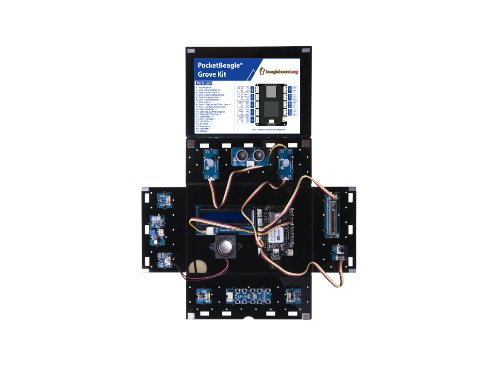

# BeagleBoard.org PocketBeagle Grove Kit


PocketBeagle is an ultra-tiny-yet-complete open-source USB-key-fob computer. PocketBeagle features an incredibly low cost, slick design, and simple usage, making PocketBeagle the ideal development board for beginners and professionals alike. Its rich features allow users to programmatically control external devices and obtain data from external devices.

Grove is a modular, standardized connector prototyping system. Consisting of Sensor, Actuator, Display, Communication, and Other function modules. Grove takes a building block approach to assemble electronics. Compared to the jumper or solder based system, it is easier to connect, experiment and build and simplifies the learning system. 

BeagleBoard.org PocketBeagle Grove Kit combines the Grove sensor modules with the powerful programming capabilities of PocketBeagle, allowing students to interact with music using real-world information such as light, touch, keyboard, Slide Potentiometer, posture and so on, to create cool projects.

## Hardware Overview


**Part List:**

- <font size="4" color="red">①</font> [Grove - Analog Microphone](TBD)
- <font size="4" color="red">②</font> [Grove - Chainable RGB LED](http://wiki.seeedstudio.com/Grove-Chainable_RGB_LED/)
- <font size="4" color="red">③</font> [Grove - Ultrasonic Distance Sensor](http://wiki.seeedstudio.com/Grove-Ultrasonic_Ranger/)
- <font size="4" color="red">④</font> [Grove - Rotary Angle Sensor](http://wiki.seeedstudio.com/Grove-Rotary_Angle_Sensor/)
- <font size="4" color="red">⑤</font> [Grove - Slide Potentiometer](http://wiki.seeedstudio.com/Grove-Slide_Potentiometer/)
- <font size="4" color="red">⑥</font> [Grove - Button](http://wiki.seeedstudio.com/Grove-Button/)
- <font size="4" color="red">⑦</font> [Grove - 12 Key Capacitive I2C Touch Sensor](http://wiki.seeedstudio.com/Grove-12_Key_Capacitive_I2C_Touch_Sensor_V2-MPR121/)
- <font size="4" color="red">⑧</font> [Grove - 3 Axis Digital Accelerometer](http://wiki.seeedstudio.com/Grove-3-Axis_Digital_Accelerometer-16g/)
- <font size="4" color="red">⑨</font> [Grove - Speaker Plus](http://wiki.seeedstudio.com/Grove-Speaker/)
- <font size="4" color="red">⑩</font> [Grove - 16x2 LCD](http://wiki.seeedstudio.com/Grove-16x2_LCD_Series/)
- <font size="4" color="red">⑪</font> [BeagleBoard.org PocketBeagle](https://beagleboard.org/pocket)
- <font size="4" color="red">⑫</font> [10pcs Alligator Cable](https://www.seeedstudio.com/10pcs-alligator-clip-test-lead-500mm-22awg-p-3087.html)
- <font size="4" color="red">⑬</font> SD+TF Card Reader
- <font size="4" color="red">⑭</font> WiFi Dongle
- <font size="4" color="red">⑮</font> Acrylic shell

## Setup the drivers on PocketBeagle

When using the provided microSD card, or a microSD card programmed using one of the provided grove-kit images, drivers and overlays to configure those drivers are already setup.

Visit [PocketBeagle Getting Started section in the System Reference Manual](https://github.com/beagleboard/pocketbeagle/wiki/System-Reference-Manual#331_Getting_Started) for information about getting started with PocketBeagle.

See https://debian.beagleboard.org/images/grove for the latest provided grove-kit images. Use the Getting Started instructions for programming the microSD card.

Read [PocketBeagle Grove Kit-setup](Kit-setup.md) to learn more about the customizations applied to this image.

Then maybe you can read below information to get how to connect wifi and get IP.`connmanctl` is a tool that connects Pockbeagle to the internet with WiFi Dongle, please refer below command

```bash
debian@beaglebone:~$ sudo connmanctl
Error getting VPN connections: The name net.connman.vpn was not provided by any
connmanctl> enable wifi
Enabled wifi
connmanctl> scan wifi
Scan completed for wifi
connmanctl> services
*AO Wired                ethernet_b827ebbde13c_cable
                         wifi_e8de27077de3_hidden_managed_none
    AH04044914           wifi_e8de27077de3_41483034303434393134_managed_psk
    Frissie              wifi_e8de27077de3_46726973736965_managed_psk
    ruijgt gast          wifi_e8de27077de3_7275696a67742067617374_managed_psk
    schuur               wifi_e8de27077de3_736368757572_managed_psk
connmanctl> agent on
Agent registered
connmanctl> connect wifi_e8de27077de3_41      # You can use the TAB key at this point to autocomplete the name
connmanctl> connect wifi_e8de27077de3_41483034303434393134_managed_psk
Agent RequestInput wifi_e8de27077de3_41483034303434393134_managed_psk
  Passphrase = [ Type=psk, Requirement=mandatory ]
Passphrase? *************
Connected wifi_e8de27077de3_41483034303434393134_managed_psk
connmanctl> quit
```
we can use `ifconfig` to get IP of PocketBeagle.
```bash
debian@beaglebone:~$ ifconfig
lo: flags=73<UP,LOOPBACK,RUNNING>  mtu 65536
        inet 127.0.0.1  netmask 255.0.0.0
        inet6 ::1  prefixlen 128  scopeid 0x10<host>
        loop  txqueuelen 1000  (Local Loopback)
        RX packets 160  bytes 11840 (11.5 KiB)
        RX errors 0  dropped 0  overruns 0  frame 0
        TX packets 160  bytes 11840 (11.5 KiB)
        TX errors 0  dropped 0 overruns 0  carrier 0  collisions 0

usb0: flags=4163<UP,BROADCAST,RUNNING,MULTICAST>  mtu 1500
        inet 192.168.7.2  netmask 255.255.255.252  broadcast 192.168.7.3
        inet6 fe80::9a5d:adff:fed1:14e1  prefixlen 64  scopeid 0x20<link>
        ether 98:5d:ad:d1:14:e1  txqueuelen 1000  (Ethernet)
        RX packets 1469  bytes 121754 (118.9 KiB)
        RX errors 0  dropped 6  overruns 0  frame 0
        TX packets 203  bytes 37968 (37.0 KiB)
        TX errors 0  dropped 0 overruns 0  carrier 0  collisions 0

usb1: flags=4099<UP,BROADCAST,MULTICAST>  mtu 1500
        inet 192.168.6.2  netmask 255.255.255.252  broadcast 192.168.6.3
        ether 98:5d:ad:d1:14:e4  txqueuelen 1000  (Ethernet)
        RX packets 0  bytes 0 (0.0 B)
        RX errors 0  dropped 0  overruns 0  frame 0
        TX packets 0  bytes 0 (0.0 B)
        TX errors 0  dropped 0 overruns 0  carrier 0  collisions 0

wlan0: flags=-28605<UP,BROADCAST,RUNNING,MULTICAST,DYNAMIC>  mtu 1500
        inet 192.168.0.153  netmask 255.255.255.0  broadcast 192.168.0.255
        inet6 fe80::bade:5eff:fe4d:4d9a  prefixlen 64  scopeid 0x20<link>
        ether b8:de:5e:4d:4d:9a  txqueuelen 1000  (Ethernet)
        RX packets 5922  bytes 545244 (532.4 KiB)
        RX errors 0  dropped 0  overruns 0  frame 0
        TX packets 7317  bytes 1453920 (1.3 MiB)
        TX errors 0  dropped 0 overruns 0  carrier 0  collisions 0
```

The wlan0's inet is the IP that you want. The IP may be different on different local.

## Lesson - 1. Control the Light

### Description:

In this lesson, students will light up the RGB LED and LCD, and learn how to use Slide Potentiometer and Rotary Angle Sensor to change the light of RGB LED.

### Hardware Requirement:

- [Grove - Slide Potentiometer](https://www.seeedstudio.com/Grove-Slide-Potentiometer.html)
- [Grove - Rotary Angle Sensor](http://wiki.seeedstudio.com/Grove-Rotary_Angle_Sensor/)
- [Grove - Chainable RGB LED](http://wiki.seeedstudio.com/Grove-Chainable_RGB_LED/)
- [Grove - 16x2 LCD](http://wiki.seeedstudio.com/Grove-16x2_LCD_Series/)

### Hardware Connection
 
- Plug the Grove - Slide Potentiometer into **A0** port
- Plug the Grove - Rotary Angle Sensor into **A5** port
- Plug the Grove - Chainable RGB LED into **A2** port
- Plug the Grove - 16x2 LCD into **I2C1** port
- Plug the WiFi dongle into the **USB** Port
- Power PocketBeagle via the **micro USB** port




### Software

- Step 1. Enter Cloud9 IDE by typing IP of PocketBeagle
- Step 2. Select PocketBeagle -> Grove
- Step 3. Run the Control_the_Light.py by using Runner:Python.

### Success
        Now please turn the rotary angle sensor slowly and slide Slide Potentiometer, and see how the RGB LED changes it's light and color.


## Lesson - 2. Musical Note

### Description:

In this lesson, students can move their hands in front of the ultrasonic distance sensor, the LCD will show the distance of the hand, and the speaker will play different musical notes based on different distances.

### Hardware Requirement:

- [Grove - Ultrasonic Distance Sensor](http://wiki.seeedstudio.com/Grove-Ultrasonic_Ranger/)
- [Grove - 16x2 LCD](http://wiki.seeedstudio.com/Grove-16x2_LCD_Series/)
- [Grove - Speaker Plus](http://wiki.seeedstudio.com/Grove-Speaker/)


### Hardware Connection
 
- Plug the Grove - Ultrasonic Distance Sensor into **A0** port
- Plug the Grove - 16x2 LCD into **I2C1** port
- Plug the Grove - Speaker Plus into **UART2** port
- Plug the WiFi dongle into the **USB** Port
- Power PocketBeagle via the **micro USB** port


### Software

- Step 1. Enter Cloud9 IDE by typing IP of PocketBeagle
- Step 2. Select PocketBeagle -> Grove
- Step 3. Run the ToneGenerator.py by using Runner:Python.

**NOTE** : we should run ToneGenerator.py when we restart after.

- Step 4. Run the Musical_Note.py by using Runner:Python.

### Success
        Now please please slowly change the distance between your hand and the ultrasonic distance sensor, you can find the distance value in the LCD change and the music switched by the distance.


## Lesson - 3. Switch the Music

### Description:

In this lesson, students will learn how to use the 2 buttons to select the next song or the last song. the buttons not only can select the next song or the last song by press instantly but also can play music by Press longly.

The LCD will show the name of the song.

### Hardware Requirement:

- [Grove – Button x 2](http://wiki.seeedstudio.com/Grove-Button/)
- [Grove – Speaker Plus](http://wiki.seeedstudio.com/Grove-Speaker/)
- [Grove – 16x2 LCD](http://wiki.seeedstudio.com/Grove-16x2_LCD_Series/)

### Hardware Connection
 
- Plug the Grove – Button into **A5** and **UART4** port
- Plug the Grove – 16x2 LCD into **I2C1** port
- Plug the Grove – Speaker Plus into **UART2** port
- Plug the WiFi dongle into the **USB** Port
- Power PocketBeagle via the **micro USB** port


### Software

- Step 1. Enter Cloud9 IDE by typing IP of PocketBeagle
- Step 2. Select PocketBeagle -> Grove
- Step 3. Run the Switch_the_Music.py by using Runner:Python.

### success
        Now please try to press the two buttons, check the LCD, and listen to music.

## Lesson - 4. Download Music via the WIFI dongle

### Description:

In this lesson, students will learn how to use the 2 buttons to select the next song or the last song. the buttons not only can select the next song or the last song by press instantly but also can play music by Press longly.

The LCD will show the name of the song.

### Hardware Requirement:

- [Grove - Button x 2](http://wiki.seeedstudio.com/Grove-Button/)
- [Grove - Speaker Plus](http://wiki.seeedstudio.com/Grove-Speaker/)
- [Grove - 16x2 LCD](http://wiki.seeedstudio.com/Grove-16x2_LCD_Series/)

### Hardware Connection
 
- Plug the Grove - Button into **A5** and **UART4** port
- Plug the Grove - 16x2 LCD into **I2C1** port
- Plug the Grove - Speaker Plus into **UART2** port
- Plug the WiFi dongle into the **USB** Port
- Power PocketBeagle via the **micro USB** port


### Software

- Step 1. Enter Cloud9 by typing IP of PocketBeagle
- Step 2. Select PocketBeagle -> Grove
- Step 3. Select File -> Upload Local Files.
- Step 4. Drag `xxx.wav` that you want to play to Cloud9.
- Step 5. Run the Switch_the_Music.py by using Runner:Python.

### success
        Default music is boring and bad taste? Now, with the help of WiFi, you can download the music to meet your own flavor.

## Lesson - 5. Keyboard Player

### Description:

In this lesson, students will learn how to use the capacitive touch sensor to play different musical note.

### Hardware Requirement:

- [Grove - 12 Key Capacitive I2C Touch Sensor](http://wiki.seeedstudio.com/Grove-12_Key_Capacitive_I2C_Touch_Sensor_V2-MPR121/)
- [Grove – Speaker Plus](http://wiki.seeedstudio.com/Grove-Speaker/)

### Hardware Connection

- Plug the Grove – Speaker Plus into **UART2** port
- Plug the Grove - 12 Key Capacitive I2C Touch Sensor into **I2C2** port
- Plug the WiFi dongle into the **USB** Port
- Power the PocketBeagle via the **micro USB** port


### Software

- Step 1. Enter Cloud9 by typing IP of PocketBeagle
- Step 2. Select PocketBeagle -> Grove
- Step 3. Run the KeyBoard_Player.py by using Runner:Python.

### success
        Try to touch the Capacitive key, image it as a keyboard, and play your music.


## Lesson - 6. Start the Party

### Description:

In this lesson, students will learn how to use the capacitive touch sensor to play the song. And the RGB LED will have different colors based on a different musical notes.

### Hardware Requirement:

- [Grove - 12 Key Capacitive I2C Touch Sensor V2](http://wiki.seeedstudio.com/Grove-12_Key_Capacitive_I2C_Touch_Sensor_V2-MPR121/)
- [Grove - Speaker Plus](http://wiki.seeedstudio.com/Grove-Speaker/)
- [Grove - Chainable RGB LED](http://wiki.seeedstudio.com/Grove-Chainable_RGB_LED/)


### Hardware Connection

- Plug the Grove - Speaker Plus into **UART2** port
- Plug the Grove - 12 Key Capacitive I2C Touch Sensor V2 into **I2C2** port
- Plug the Grove - Chainable RGB LED into **A2** port
- Plug the WiFi dongle into the **USB** Port
- Power PocketBeagle via the **micro USB** port


### Software

- Step 1. Enter Cloud9 by typing IP of PocketBeagle
- Step 2. Select PocketBeagle -> Grove
- Step 3. Run the Start_the_Party.py by using Runner:Python.

### success
        Just control the music as lesson 5, and you can see the color of RGB LED change.


## Lesson - 7. Music Box

### Description:

In this lesson, students will learn how to use the Grove - 3-Axis Accelerometer to control RGB LED and Speaker Plus. At last, he can make a smart box, by putting the different side of the box on the table, the box will have different color and play different music.

### Hardware Requirement:

- [Grove - 3 Axis Digital Accelerometer](http://wiki.seeedstudio.com/Grove-3-Axis_Digital_Accelerometer-16g/)
- [Grove - Speaker Plus](http://wiki.seeedstudio.com/Grove-Speaker/)
- [Grove - Chainable RGB LED](http://wiki.seeedstudio.com/Grove-Chainable_RGB_LED/)

### Hardware Connection

- Plug the Grove - Speaker Plus into **UART2** port
- Plug the Grove - 3 Axis Digital Accelerometer into **I2C2** port
- Plug the Chainable RGB LED into **A2** port
- Plug the WiFi dongle into the **USB** Port
- Power PocketBeagle via the **micro USB** port


### Software

- Step 1. Enter Cloud9 by typing IP of PocketBeagle
- Step 2. Select PocketBeagle -> Grove
- Step 3. Run the KeyBoard_Player.py by using Runner:Python.

### success
        Here you go, a smart music box. Just rotate the music box and dance with different music.


## Lesson - 8. Hello Kitt-AI

### Description:

In this lesson, students will learn how to install the snowboy of Kitt-AI and use it.

### Hardware Requirement:

- [Grove - Analog Microphone](http://wiki.seeedstudio.com/Grove-Analog-Microphone)
- [Grove - Speaker Plus](http://wiki.seeedstudio.com/Grove-Speaker/)
- [Grove - Chainable RGB LED](http://wiki.seeedstudio.com/Grove-Chainable_RGB_LED/)

### Hardware Connection

- Plug the Grove - Speaker Plus into **UART2** port
- Plug the Grove - Analog Microphone into **PWM** port
- Plug the Chainable RGB LED into **A2** port
- Plug the WiFi dongle into the **USB** Port
- Power PocketBeagle via the micro **USB** port


### Software

- Step 1. Enter Cloud9 IDE by typing IP of PocketBeagle
- Step 2. Select PocketBeagle -> Grove
- Step 3. Search Ok_Beagle hotword model through [snowboy](https://snowboy.kitt.ai/dashboard)
- Step 4. Click the `Record and Download` to provide data of sound for Ok_Beagle.
- Step 5. Download the Ok_Beagle.pmdl from the [website](https://snowboy.kitt.ai/hotword/46889)
- Step 6. Darg Ok_Beagle.pmdl to Cloud9 like lesson4
- Step 7. Run the Ok_Beagle.py by using Runner:Python.

### success
        The RGB LED will light up when we say Ok_Beagle to mic.
