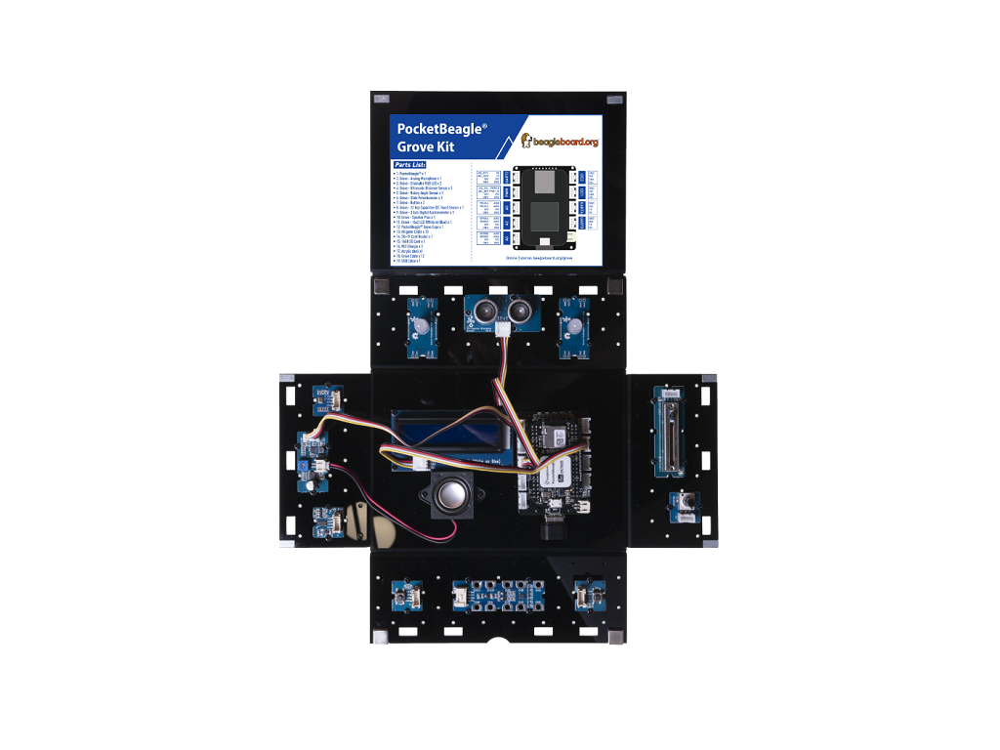

## LCD

### Description:

In this lesson the LCD will display some characters.

### Hardware Requirement:

- [Grove - 16x2 LCD](http://wiki.seeedstudio.com/Grove-16x2_LCD_Series/)


### Hardware Connection
 
- Plug the Grove - 16x2 LCD into **I2C1** port
- Plug the WiFi dongle into the **USB** Port
- Power PocketBeagle via the **micro USB** port



### Software

- Step 1. Enter Cloud9 IDE by typing IP of PocketBeagle
- Step 2. Select PocketBeagle -> Grove
- Step 3. Run the ./LCD.py by using Runner:Python.

### Success
        The following letters should appear on the LCD screen.
```bash
    "abcdefghijklmnopqrstuvwxyz012345"
    "ABCDEFGHIJKLMNOPQRSTUVWXYZ6789!@"
```