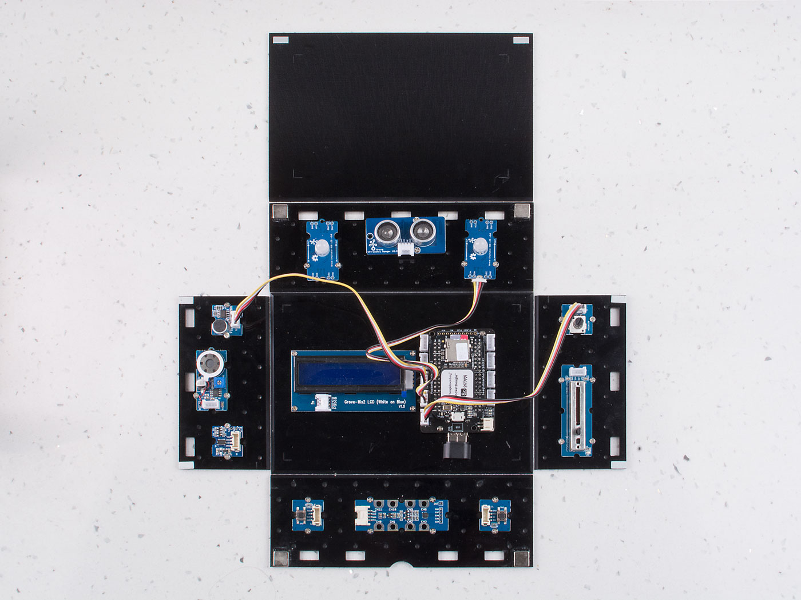

# Description:

In this lesson, students will light up the RGB LED, and learn how to use Slide Potentiometer and Rotary Angle Sensor to change the light of RGB LED.

## Hardware Requirement:

- [Grove - Slide Potentiometer](https://www.seeedstudio.com/Grove-Slide-Potentiometer.html)
- [Grove - Rotary Angle Sensor](http://wiki.seeedstudio.com/Grove-Rotary_Angle_Sensor/)
- [Grove - Chainable RGB LED](http://wiki.seeedstudio.com/Grove-Chainable_RGB_LED/)

## Hardware Connection
 
- Plug the Grove - Slide Potentiometer into **A0** port
- Plug the Grove - Rotary Angle Sensor into **A5** port
- Grove - Chainable RGB LED into **A2** port
- Power the Pocket Beagle via the **micro USB** port

<<<<<<< HEAD

=======

>>>>>>> c348a4fb7046ee1102bff10bd150d105aae01ee4

## Software

- Step 1. Enter Cloud9 by typing IP of Pocket Beagle
- Step 2. Select PocketBeagle -> Grove -> Lesson-1.Control-the-Light
- Step 3. Run the Control_the_Light.py by using Runner:Python.

<<<<<<< HEAD
## Success
        Now please turn the rotary angle sensor slowly and slide Slide Potentiometer, and see how the RGB LED changes it's light and color.
=======
!!!success
        Now please turn the rotary angle sensor slowly and slide Slide Potentiometer, and see how the RGB LED changes it's light and color.
>>>>>>> c348a4fb7046ee1102bff10bd150d105aae01ee4
