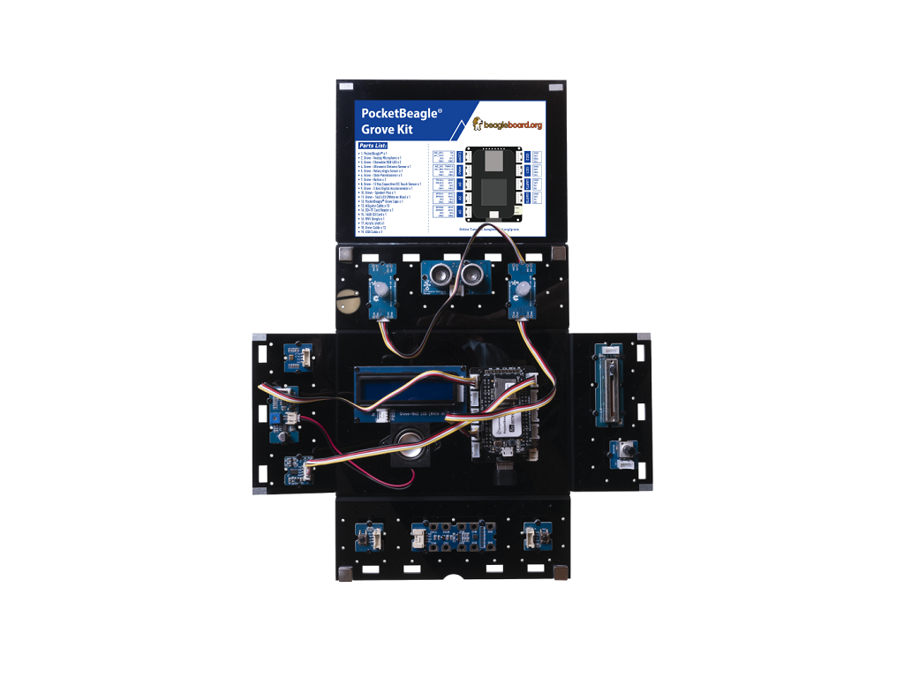

## Lesson - 7. Music Box

### Description:

In this lesson, students will learn how to use the Grove - 3-Axis Accelerometer to control RGB LED and Speaker Plus. At last, he can make a smart box, by putting the different side of the box on the table, the box will have different color and play different music.

### Hardware Requirement:

- [Grove - 3 Axis Digital Accelerometer](http://wiki.seeedstudio.com/Grove-3-Axis_Digital_Accelerometer-16g/)
- [Grove - Speaker Plus](http://wiki.seeedstudio.com/Grove-Speaker/)
- [Grove - Chainable RGB LED](http://wiki.seeedstudio.com/Grove-Chainable_RGB_LED/)

### Hardware Connection

- Plug the Grove - Speaker Plus into **UART2** port
- Plug the Grove - 3 Axis Digital Accelerometer into **I2C2** port
- Plug the Chainable RGB LED into **A2** port
- Plug the WiFi dongle into the **USB** Port
- Power PocketBeagle via the **micro USB** port

### Software

- Step 1. Enter Cloud9 by typing IP of PocketBeagle
- Step 2. Select PocketBeagle -> Grove
- Step 3. Run the KeyBoard_Player.py by using Runner:Python.

### Success
        Here you go, a smart music box. Just rotate the music box and dance with different music.
