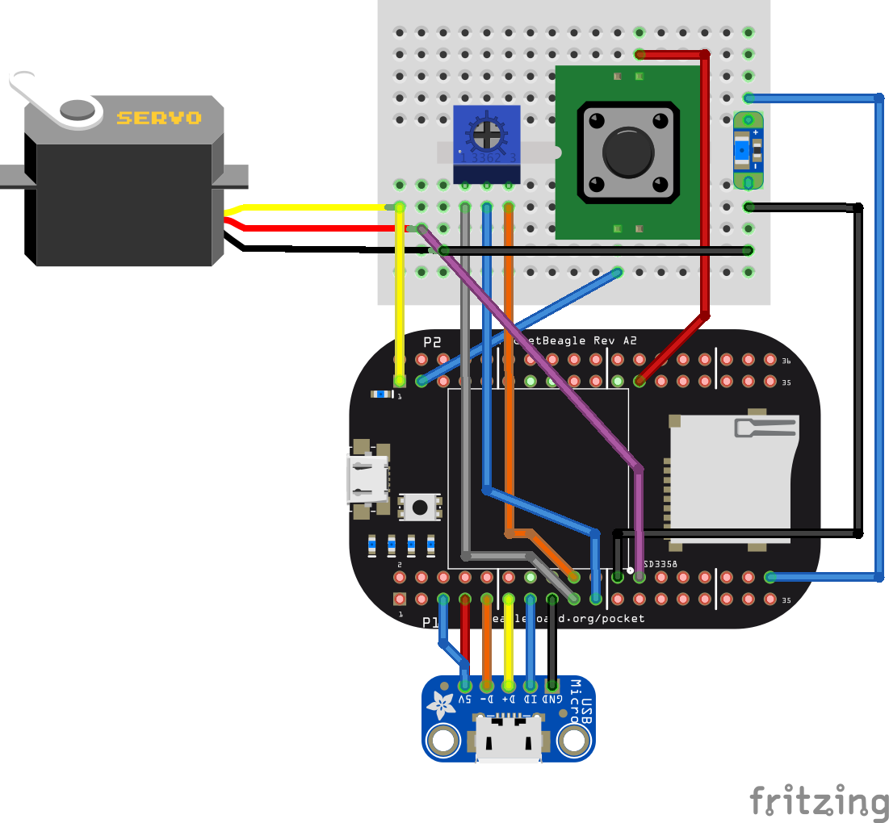

PocketBeagle tutorial and example code

These examples have been taken from many places and customized for PocketBeagle.

* Digi-Key shopping list: http://www.digikey.com/short/q8tmdv

The following files are:

File                | Description
----                | -----------
[analogInOut.js](analogInOut.js)    | Reads analog in and adjusts the PWM.
[analogInSync.js](nalogInSync.js)   | Reads analog in synchronously and prints it.
[analogInCallback.js](analogInCallback.js) | Reads analog in and prints it via a callback.
[blinkLED.c](blinkLED.c )           | Blinks the USR3 LED via c.
[blinkLED.js](blinkLED.js)          | Blinks the USR LEDs and P9_14.
[blinkLED.py](blinkLED.py)          | Blinks one LED via python.
[fadeLED.js](fadeLED.js)            | Fades the LED using the PWM.
[input.js](input.js)                | Responds to changes on input via a callback.
[input2.js](input2.js)              | Responds to changes on 2 inputs via callbacks.
[seqLED.py](seqLED.py)              | Blinks the USR LEDs in sequence in python.
[swipeLED.js](swipeLED.js)          | Blinks the USR LEDs in sequence.
