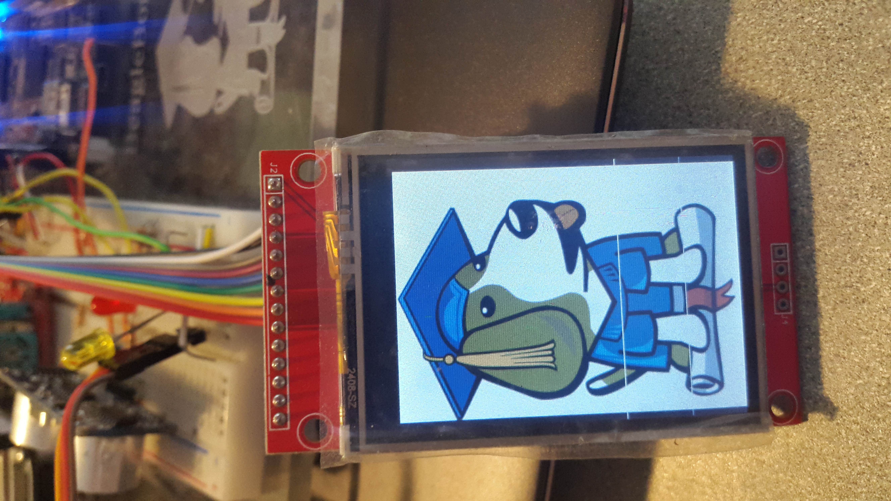

# Display Examples
Here are examples of how to interface common displays.

Script            | Description
------            | -----------
[i2cmatrix.py](#matrix)     | Writes to an 8-by-8 bi-color LED matrix
[LCD-display.sh](#LCD-Display-SPI)                    | Display an image using a ili9341 TFT LCD display via SPI

# LCD Display SPI

Here's how to interface the [Adafruit 2.4" TFT LCD](https://www.adafruit.com/product/2478).
The LCD display uses a ili9341 interface, so these directions will work with most
any display using the ili9341.  The ili9341 uses a 
[SPI serial interface](https://en.wikipedia.org/wiki/Serial_Peripheral_Interface).
The Beagles have multiple SPI interfaces shown below.  Pick which platform
you are using and which SPI bus you want to use.

### Using SPI 0

Pin     | Black | gpio # | Pocket | gpio #
---     | ----- | ------ | ------ | -----
MISO    | P9_21 | 3      | P1.10  | 
LED     | P9_16 | 51     | P2.01  |
SCK     | P9_22 | 2      | P1.08
MOSI    | P9_18 | 4      | P1.12
D/C     | P9_19 | 13     | P2.04  | 58
RESET   | P9_20 | 12     | P2.06  | 57
CS      | P9_17 | 5      | P1.06
|
GND     | P9_2  |        | P1.16
VCC     | P9_4  |        | P1.14

#### SPI 1
Pin     | Black | gpio # 
---     | ----- | ------ 
MISO    | P9_29 |   
LED     | P9_26 | 14   
SCK     | P9_31 |
MOSI    | P9_30 | 
D/C     | P9_27 | 115
RESET   | P9_25 | 117
CS      | P9_28 | 113

#### SPI 2
Pin     | AI     | gpio # | 
---     | -----  | ------ 
MISO    | P9_18a |        | (Switched from Black)
LED     | P9_26  | 174
SCK     | P9_22b |
MOSI    | P9_21b |        | (Switched from Black)
D/C     | P9_27  | 111
RESET   | P9_25  | 177
CS      | P9_17a | 207

#### SPI 3
Pin     | AI     | gpio # | 
---     | -----  | ------ 
MISO    | P9_30  |        | (Switched from Black)
LED     | P9_26  | 174  
SCK     | P9_31a |
MOSI    | P9_29a |        | (Switched from Black)
D/C     | P9_27  | 111
RESET   | P9_25  | 177
CS      | P9_28  | 

Edit ```LCD-on.sh``` and uncomment the sections for you platform and
SPI bus.  Also edit ```LCD-backlight.py```.  Then run:

```bone$ ./LCD-on.sh```

This will insert the correct kernel modules and after a moment a 
framebuffer will appear at ```/dev/fb0```.  To display an image on the
framebuffer, run:
```
bone$ sudo apt update
bone$ sudo apt install fbi
bone$ fbi -noverbose -T 1 -a images/boris.png
```

Boris should appear on the LCD.


