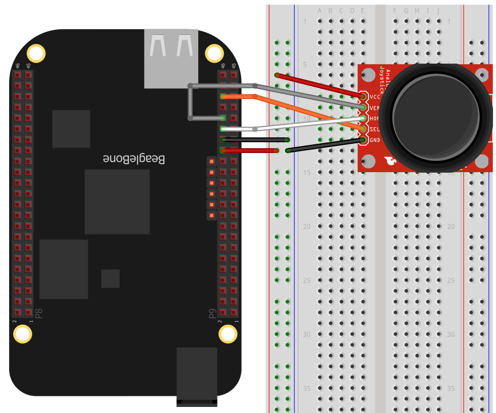

# Sensor Examples
Here are examples of how to interface common sensors and input devices.

Script            | Description
------            | -----------
[accelerometer.js](#accelerometer)                    | This example reads values from Sparkfun’s ADXL335 3-axis accelerometer. 
[hc-sr04-ultraSonic.js](#adafruit-2-axis-thumb-joystick) | Shows how to use a HC-SR04 Ultrasonic Range Sensor.
[i2cTemp.js](#measuring-a-temperature)                | Use TMP102 sensor to measure a temp va i2c.
[joystick.js](#adafruit-2-axis-thumb-joystick)        | The Analog 2-axis Thumb Joystick allows you to easily mount a PSP/Xbox-like thumb joystick to your project.
[motionSensor.js](#pir-motion-sensor)                 | The PIR Motion Sensor, or Passive Infrared Sensor, is a sensor that takes a snapshot of the room and it detects changes in heat.
[potentiometer.js](#potentiometer)                    | A specific voltage can be sent to the AIN1 channel using a potentiometer. 
[rotaryEncoder.js](#accurately-reading-the-position-of-a-motor-or-dial--rotary-encoders)  | How do use a rotary encoder (_quadrature encoder_) connected to the Bone's eQEP ports
[servo.js](#micro-servo-motor)                        | The Micro Servo Motor can rotate 180 degrees and is usually used in applications such as robotics, CNC machinery, or automated manufacturing.
[tempHumidity.js]                                     | Uses si7021 to read temp and humidity via I2C. 
[tempPressure.js](#bmp085-i2c-pressure-temperature-sensor-demo)   | The BMP085 is a readily available pressure/temperature sensor using I2C. 
[ultrasonic.js](#maxbotic-ultrasonic-sensor)          | The LV-MaxSonar-EZ2 High Performance Sonar Range Finder provides very short to long-range detection and ranging, in an incredibly small package. 

# Pins used

Demo                 |     | Output | Input | Pull | I2C
----                 | --- | ------ | ----- | ---- | ---
accelerometer.js     | AIN |
hc-sr04-ultraSonic.js|     | P9_15  | P9_17 | 
i2cTemp.js           |     |        |       |      | P9_19, P9_20
joystick.js          | AIN |        | P9_18 | up   |
motionSensor.js      |     | P9_15  | P9_29 |      |
potentiometer.js     | AIN |
rotaryEncoder.js     |     |        | P8_33, P8_35 | down
servo.js             | PWM |
tempHumidity.js      |     |        |       |      | P9_19, P9_20
tempPressure.js      |     |        |       |      | P9_19, P9_20
ultrasonic.js        | AIN |

# Accelerometer

This example reads values from Sparkfun’s ADXL335 3-axis accelerometer. 
Because the output of the ADXL335 is between 0-3.3V and because BeagleBone's 
analogRead pins are 1.8V tolerant, we used a hardware (resistor) voltage divider 
on each of the accelerometer outputs. This provides a range of 0-1.65V to be 
read on BeagleBone analogRead pins.

* NOTE: Due to output impedance of the ADXL335 being ~32kOhms, 
a low resistor value for the voltage divider is recommended (between 500 Ohms- 1k Ohms).*

We need to do simple math before we continue. Ultimately, we want to know the 
value in G’s being exerted on the accelerometer. 
The output of the accelerometer is in volts. 
The first thing we need to do is calculate a formula that will convert volts to 
Gs for us in our software. This formula for us is:

(axisRead - zeroOffset) / (conversionFactor) = acceleration

Where: zeroOffset = 0.0917 and conversionFactor = 0.4584


## Build and execute instructions
* Hook up BeagleBone to the breadboard as shown in the diagram.

Accelerometer | Pin  | Bone  | Pocket | Grove
------------- | ---  | ----- | ------ | -----
GND           | GND  | P9_1  | P2_15
VCC           | 3.3V | P9_3  | P1_14
X             | A5   | P9_36 | P2_35  | A5-1
Y             | A3   | P9_38 | P1_25  | A2-2
Z             | A1   | P9_40 | P1_21  | A0-2

* After clicking ‘run’, notice the console output above for the accelerometer data.
* Experiment by altering the second argument in ```setTimeout(clear, x)``` to 
another number where x is a value in milliseconds 
(this value determines how long the example will run).

# Reading a Distance Sensor (Variable Pulse Width Sensor)

You want to use a HC-SR04 Ultrasonic Range Sensor with BeagleBone Black.

The HC-SR04 Ultrasonic Range Sensor (shown in below) works by sending a trigger pulse to the _Trigger_ input and then measuring the pulse width on the _Echo_ output. The width of the pulse tells you the distance.


Wire the sensor as shown below. Note that the HC-SR04 is a 5 V
device, so the _banded_ wire (running from ```P9_7``` on the Bone to VCC on the range finder) attaches the HC-SR04 to the Bone's 5 V power supply. 


This code is more complex than others, because we have to tell the device when to start measuring and time the return pulse.

HC-SR04 | Pin   | Bone  | Pocket
------- | ---   | ----  | ------
GND     | GND   | P9_1  | P2_15
V+      | 3.3V  | P9_3  | P1_14
trigger | out   | P9_15 | 
echo    | in    | P9_17 | 

# Measuring a Temperature

You want to measure a temperature using a digital temperature sensor.

The TMP102 sensor is a common digital temperature sensor that uses a standard I2C-based serial protocol.

Wire the TMP102, as shown.


There are two I2C buses brought out to the headers. The figure shows that you have wired your device to I2C bus ```2```, but watch out: the buses aren't always numbered the same. When you work with BoneScript, they are numbered ```1``` and ```2```, but if you work from the Linux command line, they are numbered ```0``` and ```1```. Confusing, huh?


Once the I2C  device is wired up, you can use a couple handy I2C tools to test the device. Because these are Linux command-line tools, you have to use ```1``` as the bus number. ```i2cdetect```, shown below, shows which I2C devices are on the bus. The ```-r``` flag indicates which bus to use. Our TMP102 is appearing at address ```0x49```. You can use the ```i2cget``` command to read the value. It returns the temperature in hexidecimal and degrees C. In this example, 0x18 = 24C, which is 75.2F. (Hmmm, the office is a bit warm today.) Try warming up the TMP102 with your finger and running ```i2cget``` again.

```
bone# i2cdetect -y -r 1
     0  1  2  3  4  5  6  7  8  9  a  b  c  d  e  f
00:          -- -- -- -- -- -- -- -- -- -- -- -- -- 
10: -- -- -- -- -- -- -- -- -- -- -- -- -- -- -- -- 
20: -- -- -- -- -- -- -- -- -- -- -- -- -- -- -- -- 
30: -- -- -- -- -- -- -- -- -- -- -- -- -- -- -- -- 
40: -- -- -- -- -- -- -- -- -- 49 -- -- -- -- -- -- 
50: -- -- -- -- UU UU UU UU -- -- -- -- -- -- -- -- 
60: -- -- -- -- -- -- -- -- -- -- -- -- -- -- -- -- 
70: -- -- -- -- -- -- -- --

bone# i2cget -y 1 0x49
0x18
```
# Adafruit 2-Axis Thumb Joystick

The [Analog 2-axis Thumb Joystick](http://www.adafruit.com/products/512) 
allows you to easily mount a PSP/Xbox-like thumb joystick to your project. 
Using analog pins, the BeagleBone will read and determine both the X and Y axis. 
The joystick also includes an extra digital input that will let you read the switch.

*The console will output both the x-axis and y-axis with readings from 0-100, 
with (50,50) being the center location.*



[Grove Joystick](http://wiki.seeedstudio.com/Grove-Thumb_Joystick/)

## Build and execute instructions
* Connect the following pins

Joysitck | Pin     | Bone  | Pocket | Grove
-------- | ---     | ----- | ------ | -----
VCC      | 1.8V    | P9_32 | P1_18
GND      | GND     | P9_34 | P1_17
HOR      | A2      | P9_37 | P1_23  | A2-1
VER      | A3      | P9_38 | P1_25  | A2-2
SEL      | GPIO0_7 | P9_42 | P2_29

* Click "Run" and it will output both the x and y axis, with 50,50 being the center.

# PIR Motion Sensor
The PIR Motion Sensor, or Passive Infrared Sensor, is a sensor that takes a snapshot 
of the room and sets the ```alarm``` pin to ```LOW``` if it detects changes in heat. 
Since this sensor is an [open collector](http://en.wikipedia.org/wiki/Open_collector),
it needs a pull-up resistor on the alarm pin, which allows multiple motion sensors to 
be connected on a single input pin. If motion is detected in this
demo, it will output "Motion Detected" on the console and will turn on the LED.


[Grove Motion Sensor](http://wiki.seeedstudio.com/Grove-PIR_Motion_Sensor/)

## Build and execute instructions
* Connect the '+' pin from the sensor to 'P9_5' of the BeagleBoard in series with
a 10kohm resistor.
* Connect the '-' pin from the sensor to 'P9_1' of the BeagleBoard.
* Connect the 'AL' pin from the sensor to 'P8_19' of the BeagleBoard in series
with a 10kohm resistor.
* Connect the LED with a 470ohm resistor
* Click "Run" on the code. Every 2.5 seconds, the console will tell you if 
there was motion detected. If there was motion detected, the LED will also turn on.

PIR     | Pin   | Bone  | Pocket
------- | ---   | ----  | ------
GND     | GND   | P9_1  | P2_15
V+      | 5V    | P9_7  | P1_24
in      | in    | P9_29 | P1_34

# Potentiometer

A specific voltage can be sent to the AIN1 channel using a potentiometer. 
Please keep in mind that each one of the ADC pins can only **handle 1.8V maximum**.


[Grove potentiometer](http://wiki.seeedstudio.com/Grove-Slide_Potentiometer/)

## Build and execute instructions
* Hook up a BeagleBone or BeagleBone Black to the breadboard as shown in the diagram.

Potentiometer  | Pin  | Bone  | Pocket | Grove
-------------- | ---  | ----- | ------ | -----
outer terminal | 1.8V | P9_32 | P1_18
outer terminal | GND  | P9_34 | P1_17
wiper (middle) | A1   | P9_40 | P1_21  | A0-2

* After clicking ‘run’, the ADC1 channel will output a reading between 0-1, 
where 0 is 0V and 1 is the maximum input voltage (1.8V).
* Adjust your potentiometer's knob and click run again. 
The lower the resistance, the higher voltage you will see.
* Alter the code to look at inputs on other analog input pins. 
A schematic showing all available ADC channels are listed 
[here](https://elinux.org/Beagleboard:Cape_Expansion_Headers#Cape_Expansion_Headers).

Analog pin mapping on AI

Bone P9 | AIN | /sys/bus/iio/devices/iio:device0/in_voltage*_raw
------- | --- | ---
39      | 0   | 0
40      | 1   | 1
37      | 2   | 3
38      | 3   | 2
33      | 4   | 7
36      | 5   | 6
35      | 6   | 4

Analog pin mapping on Black/Pocket

Black | Pocket | AIN | /sys/bus/iio/devices/iio:device0/in_voltage*_raw
----- | ------ | --- | ---
P9_39 | P1_19  | 0   | 0
P9_40 | P1_21  | 1   | 1
P9_37 | P1_23  | 2   | 2
P9_38 | P1_25  | 3   | 3
P9_33 | P1_27  | 4   | 4
P9_36 | P2_35  | 5   | 5
P9_35 | P1_02  | 6   | 6


# Accurately Reading the Position of a Motor or Dial: Rotary Encoders

You have a motor or dial and want to detect rotation using a rotary encoder.

Use a rotary encoder (also called a _quadrature encoder_) connected to one of the Bone's eQEP ports, as shown below.


We are using a quadrature rotary encoder, which has two switches inside that open and close in such a manner that you can tell which way the shaft is turning. In this particular encoder, the two switches have a common lead, which is wired to ground. It also has a pushbutton switch wired to the other side of the device, which we aren't using. 

Wire the encoder to ```P8_11``` and ```P8_12```, as shown.

BeagleBone Black has built-in hardware for reading up to three encoders.  
Here, we use the _eQEP2_ encoder.

Try rotating the encoder clockwise and counter-clockwise. The values you get for ```speed``` and ```position``` will depend on which way you are turning the device and how quickly. You will need to press ^C (Ctrl-C) to end the program.


# Micro Servo Motor
*Output a pulse width modulated signal on a Servo Motor.*

The [Micro Servo Motor](http://www.adafruit.com/products/169) 
can rotate 180 degrees and is usually used in applications 
such as robotics, CNC machinery, or automated manufacturing. 
By using the```'analogWrite``` function [```analogWrite(pin, value, [freq], [callback])```, 
the BeagleBone will send Pulse Width Modulated Signals to control the Servo Motor. 
The position of the servo motor is set by the length of a pulse. 
In the following program, the frequency is set at 60Hz, which means that the 
servo receives a pulse every 16.66ms. The length of the pulse, or the duty cycle, 
can be changed from 3% to 14.5% and can be changed to rotate the servo motor.

The example below, when run, will adjust the position of the servo motor between its two extremes repeatitively.

More information regarding PWMs can be found on the 
[Wikipedia pulse-width modulation page](https://en.wikipedia.org/wiki/Pulse-width_modulation).


[Grove servo](http://wiki.seeedstudio.com/Grove-Servo/)

## Build and execute instructions
* Connect the pins as follows:

Servo | Pin  | Bone  | Pocket | Grove
----- | ---  | ----- | ------ | -----
GND   | GND  | P9_1  | P2_15
V+    | 3.3V | P9_3  | P1_14
PWM   | PWM via 1kOhm resistor | P9_14 | P1_36 | PWM-1

* Connect a 1kohm resistor to the "PWM" pin of the Servo Motor and to P9_14 of the board.
* Click "Run" on the code. The value of 'position' will go between 0 and 1 
changing by 'increment' amount with updates every 200ms.


# BMP085 I2C pressure/temperature sensor demo
The BMP085 is a readily available pressure/temperature sensor using I2C. 
It is directly supported by the Linux kernel, so all you have to do is ask 
the kernel to load the driver and then start reading values.


[Grove barometer sensor](http://wiki.seeedstudio.com/Grove-Barometer_Sensor/)

## Build and execute instructions

Connect the pins as follows:

BMP085 | Pin       | Bone  | Pocket | Grove
-------| ---       | ----- | ------ | -----
GND    | GND       | P9_1  | P2_15
V+     | 3.3V      | P9_3  | P1_14
SCL    | I2C2 SCL  | P9_19 | P1_28  | I2C2-1
SDA    | I2C2 SDA  | P9_20 | P1_26  | I2C2-2

# Maxbotic Ultrasonic Sensor

The [LV-MaxSonar-EZ2 High Performance Sonar Range Finder](http://www.maxbotix.com/Ultrasonic_Sensors/MB1020.htm) 
provides very short to long-range detection and ranging, in an incredibly small package. 
The sonar detects objects from 0-254 inches and provides sonar range information 
from 6-inches out to 254-inches with 1-inch resolution.

*Note: Each time after the Sonar is powered up, it will calibrate during its first read cycle. 
The sensor uses this stored information to range a near object. 
It is important that objects not be close to the sensor during this calibration cycle. 
The best sensitivity is obtained when it is clear for fourteen inches, 
but good results are common when clear for at least seven inches. 
If an object is too bear the Sonar during the calibration cycle, 
the sensor may then ignore the objects at that distance. 
To calibrate the LV-MAX Sonar, cycle power then command a read cycle.*

The AN pin outputs a voltage with a scaling factor of (Vcc/512) per inch. 
Since the AIN pin has a maximum voltage capacity of 1.8V, 
we will set a voltage divider to account for that difference. 
With the voltage divider, a supply of 5V yields ~6.99mV/in. and 3.3V yields ~4.57mV/in.


## Build and execute instructions
* Connect the 1.2k ohm resistor to the AN pin of the supersonic sensor.
* Connect the 3k ohm resistor in series with the 1.2k ohm resistor and tie the 
bottom to ground, as shown in the diagram.
* Connect the pins as follows:

Ultrasound | Pin  | Bone  | Pocket
---------- | ---  | ----- | ------
GND        | GND  | P9_1  | P2_15
+5         | 3.3V | P9_3  | P1_14
series with 3k ohm and 1.2k ohm resistor | A1 | P9_40 | P1_21

* Click "Run" on the code and it will output the distance, in inches,
that the sensor is detecting... updating every 5 seconds
* Move the sensor nearer to or farther from an object to see the change in distance

